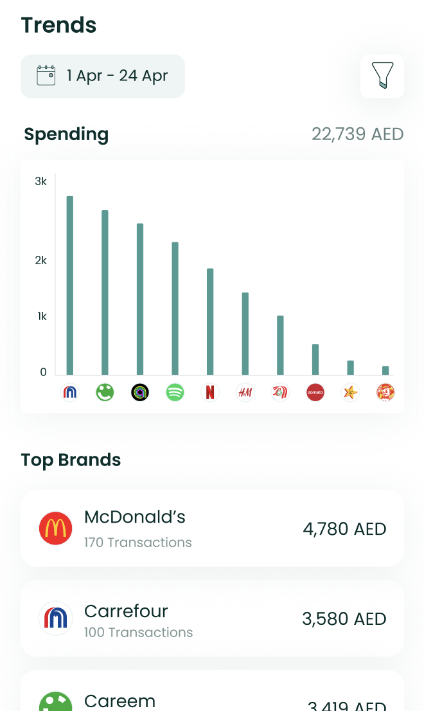

# BrandTrendsComponent



Besides showing the user's spend on each Brand, the
`BrandTrendsComponent` uses a chart to show the user's spend per day. It
also allows users to filter data by category, tags and dates by default.

To use this view in a SwiftUI project, just call the
`BrandTrendsComponent` method of your `LuneSDKManager` instance as shown
in the example below.

```swift
// Trends.Swift

import SwiftUI
import LuneSDK

struct TrendView: View {
    // removed for simplicity...

    var body: some View {
        luneSDK.BrandTrendsComponent()
    }
}
```

To use this view in an Objective-C project, just call the
`BrandTrendsComponent` method of your `LuneSDKObjcManager` instance as
shown in the example below.

```swift
// YourViewController.m

- (void)viewDidLoad {
    [super viewDidLoad];

    // brand trends setup, after initilizing luneSDK

    UIViewController *hostingController = [self.luneSDK BrandTrendsComponentWithConfig:nil];

    [self addChildViewController:hostingController];
    [self.view addSubview:hostingController.view];

    // constraints setup removed for simplicity...
}
```

---

## Localization Keys and Analytics


Analytics Tags

1. `date_picker_button`
2. `filter_button`
3. `spending_amount`
4. `brand_amount`
5. `brand_tile`

Localization Keys

1. `lune_sdk_str_brand_trends`
2. `lune_sdk_str_spending`
3. `lune_sdk_str_top_brands`

---


Analytics Tags

1. `close_button`
2. `category_filter_option`
3. `apply_button`
4. `reset_button`

Localization Keys

1. `lune_sdk_str_filter_by_category`
2. `lune_sdk_str_search`
3. `lune_sdk_str_apply`
4. `lune_sdk_str_reset`
