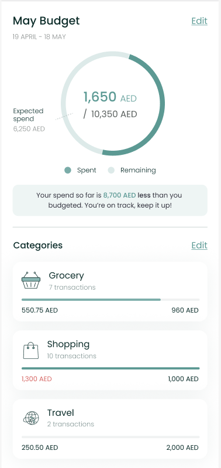

# BudgetComponent



The `BudgetComponent` shows the user's spend against the budget he/she
had set previously. In the case that the user doesn't already have a
budget, it allows the user to set one easily.

To use this view in a SwiftUI project, just call the `BudgetComponent`
method of your `LuneSDKManager` instance as shown in the example below.

```swift
// BudgetComponent.Swift

import SwiftUI
import LuneSDK

struct BudgetComponent: View {
    // removed for simplicity...

    var body: some View {
        luneSDK.BudgetComponent()
    }
}
```

To use this view in an Objective-C project, just call the
`BudgetComponent` method of your `LuneSDKObjcManager` instance as shown
in the example below.

```swift
// YourViewController.m

- (void)viewDidLoad {
    [super viewDidLoad];

    // budget setup, after initilizing luneSDK

    UIViewController *hostingController = [self.luneSDK BudgetComponentWithConfig:nil];

    [self addChildViewController:hostingController];
    [self.view addSubview:hostingController.view];

    // constraints setup removed for simplicity...
}
```
