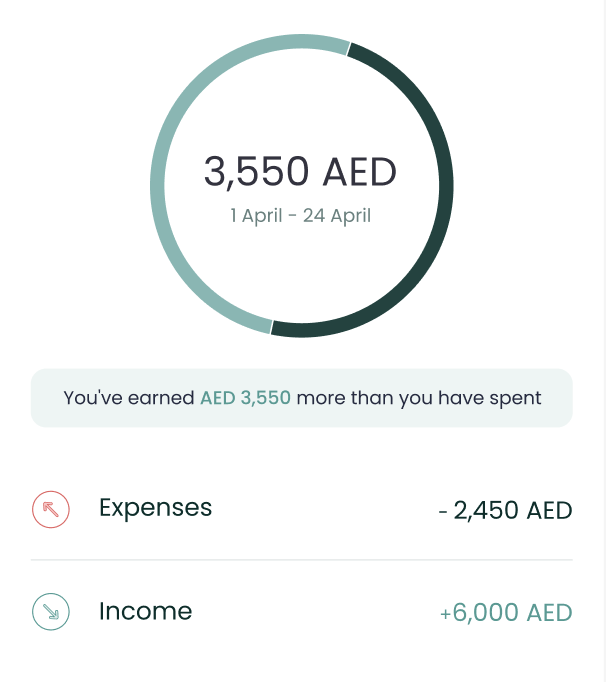
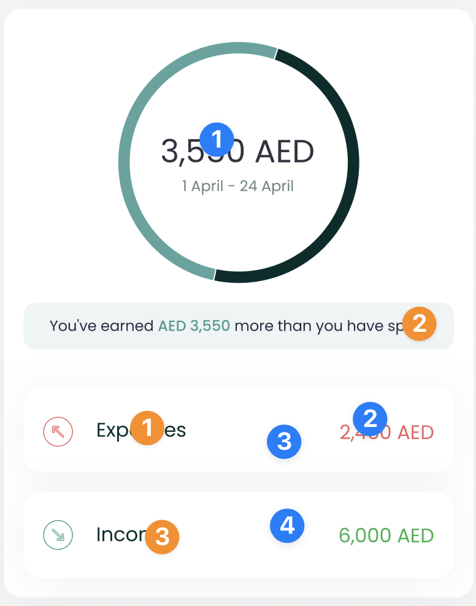

# CashflowComponent



The `CashflowComponent` shows the user's gross expense and income over a
period of time, along with the difference between them.

To use this view in a SwiftUI project, just call the `CashflowComponent`
method of your `LuneSDKManager` instance as shown in the example below.

```swift
// HomeView.Swift

import SwiftUI
import LuneSDK

struct HomeView: View {
    // removed for simplicity...

    var body: some View {
        luneSDK.CashflowComponent()
    }
}
```

✨ You can now add an optional argument to the `slotContent` parameter
if you need to render a custom view below the page content.

Here is a simple example with a list of cards.

```swift
// HomeView.Swift

import SwiftUI
import LuneSDK

struct HomeView: View {
    // removed for simplicity...
    var body: some View {

        luneSDK.CashflowComponent(
            slotContent: {

                // add any custom view in here 👇🏽

                VStack(alignment: .leading) {
                    HStack {
                        Text("Title")
                        Spacer()
                        Text("Action")
                    }
                    ScrollView(.horizontal) {
                       HStack {
                            ForEach(0..<5, id: \.self) { _ in
                                Text("Hey yo!")
                                .padding()
                                .background(Color.random())
                            }
                        }
                    }
                }
                .padding()

            }
        )
    }
}
```

To use this view in an Objective-C project, just call the
`CashflowComponent` method of your `LuneSDKObjcManager` instance as
shown in the example below.

```swift
// YourViewController.m

- (void)viewDidLoad {
    [super viewDidLoad];

    // cashflow setup, after initilizing luneSDK

    UIViewController *hostingController = [self.luneSDK CashflowComponentWithConfig:nil];

    [self addChildViewController:hostingController];
    [self.view addSubview:hostingController.view];

    // constraints setup removed for simplicity...
}
```

---

## Localization Keys and Analytics



Analytics Tags

1. `cashflow_amount`
2. `outflow_amount`
3. `outflow_tile`
4. `inflow_tile`

Localization Keys

1. `lune_sdk_str_outflow`
2. `lune_sdk_str_inflow`
3. `lune_sdk_str_you've_spent_`,
   `lune_sdk_str__more_than_you_have_earned`,
   `lune_sdk_str_you've_earned_`,
   `lune_sdk_str__more_than_you_have_spent`
