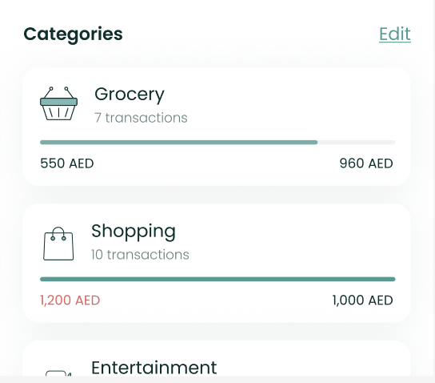

# CategorySpendListComponent



The `CategorySpendListComponent` shows the user's overall spend in
contrast to his budget and his expected spend per time.

To use this view in a SwiftUI project, just call the
`CategorySpendListComponent` method of your `LuneSDKManager` instance as
shown in the example below.

```swift
// BudgetView.Swift

import SwiftUI
import LuneSDK

struct BudgetView: View {
    // removed for simplicity...

    var body: some View {
        luneSDK.CategorySpendListComponent()
    }
}
```

To use this view in an Objective-C project, just call the
`CategorySpendListComponent` method of your `LuneSDKObjcManager`
instance as shown in the example below.

```swift
// YourViewController.m

- (void)viewDidLoad {
    [super viewDidLoad];

    // category spend setup, after initilizing luneSDK

    UIViewController *hostingController = [self.luneSDK CategorySpendListComponentWithConfig:nil];

    [self addChildViewController:hostingController];
    [self.view addSubview:hostingController.view];

    // constraints setup removed for simplicity...
}
```
