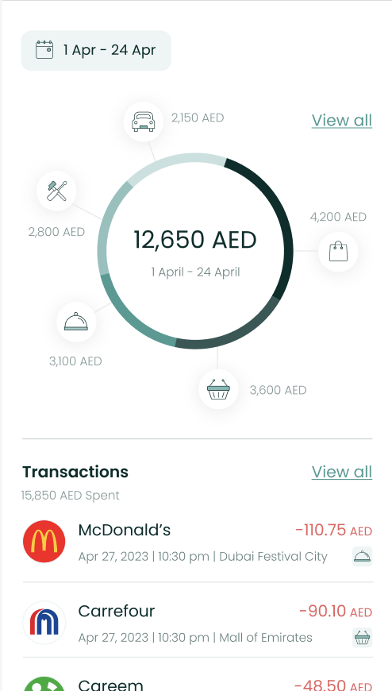
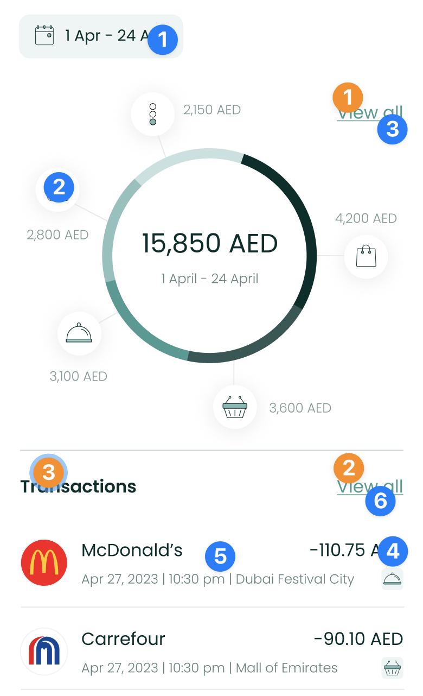
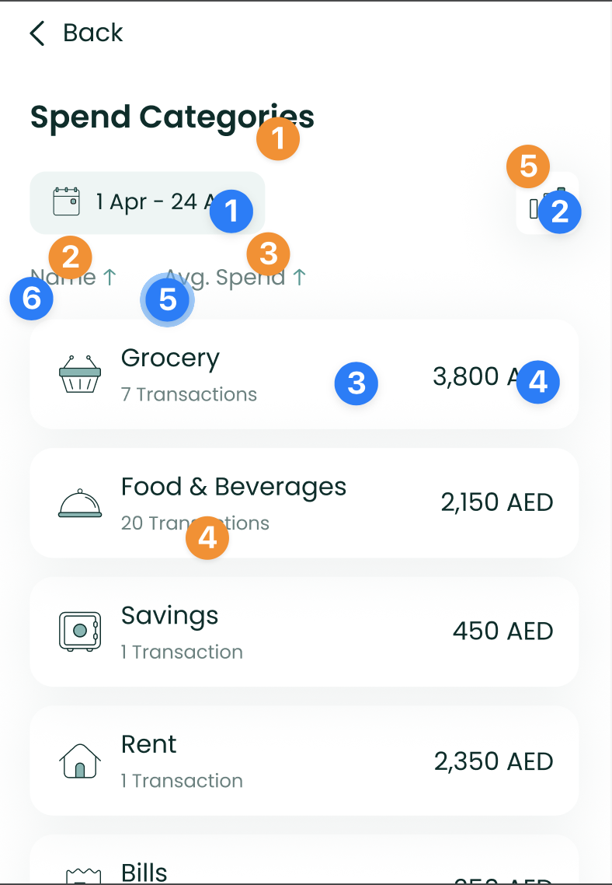

# Expense Component



The `ExpenseComponent` shows the user's spend across categories in a
neat donut chart, along with a list of recent transactions. Users are
able to view data for previous months easily too.

To use this view in a SwiftUI project, just call the `ExpenseComponent`
method of your `LuneSDKManager` instance as shown in the example below.

```swift
// HomeView.Swift

import SwiftUI
import LuneSDK

struct HomeView: View {
    // removed for simplicity...

    var body: some View {
        luneSDK.ExpenseComponent()
    }
}
```

✨ You can now add an optional argument to the `slotContent` parameter
if you need to render a custom view between the chart and the
transaction list.

Here is a simple example with a list of cards.

```swift
// HomeView.Swift

import SwiftUI
import LuneSDK

struct HomeView: View {
    // removed for simplicity...
    var body: some View {

        luneSDK.ExpenseComponent(
            slotContent: {

                // add any custom view in here 👇🏽

                VStack(alignment: .leading) {
                    HStack {
                        Text("Title")
                        Spacer()
                        Text("Action")
                    }
                    ScrollView(.horizontal) {
                       HStack {
                            ForEach(0..<5, id: \.self) { _ in
                                Text("Hey yo!")
                                .padding()
                                .background(Color.random())
                            }
                        }
                    }
                }
                .padding()

            }
        )
    }
}
```

To use this view in an Objective-C project, just call the
`ExpenseComponent` method of your `LuneSDKObjcManager` instance as shown
in the example below.

```swift
// YourViewController.m

- (void)viewDidLoad {
    [super viewDidLoad];

    // cashflow setup, after initilizing luneSDK

    UIViewController *hostingController = [self.luneSDK ExpenseComponentWithConfig:nil];

    [self addChildViewController:hostingController];
    [self.view addSubview:hostingController.view];

    // constraints setup removed for simplicity...
}
```

---

## Localization Keys and Analytics



Analytics Tags

1. `date_picker_button`
2. `chart_icon`
3. `chart_view_all`
4. `transaction_amount`
5. `transaction_tile`
6. `transactions_view_all`

Localization Keys

1. `lune_sdk_str_view_all`
2. `lune_sdk_str_view_all`
3. `lune_sdk_str_transactions`

---



Analytics Tags

1. `date_picker_button`
2. `trends_button`
3. `category_tile`
4. `category_amount`
5. `avg_spend_sort_button`
6. `name_sort_button`

Localization Keys

1. `lune_sdk_str_spend_categories`
2. `lune_sdk_str_name`
3. `lune_sdk_str_avg_spend`
4. `lune_sdk_str_transaction_count`
5. `lune_sdk_str_trends`
