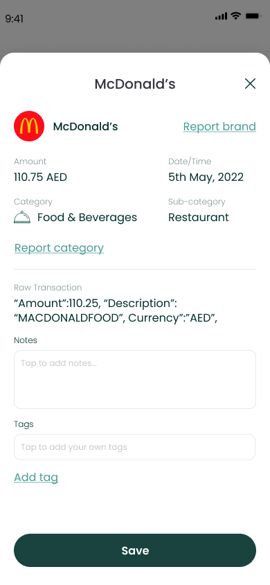
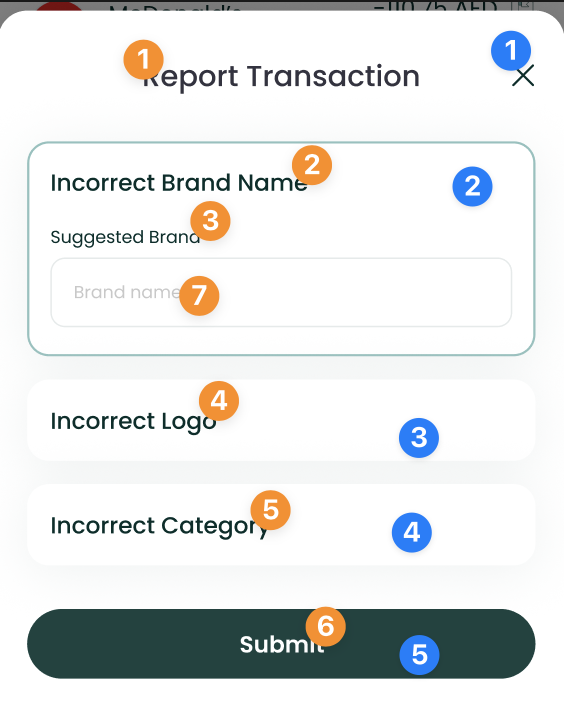
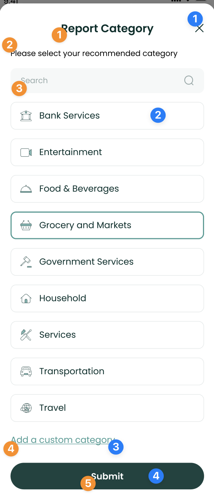
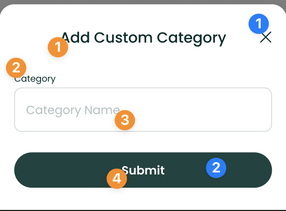
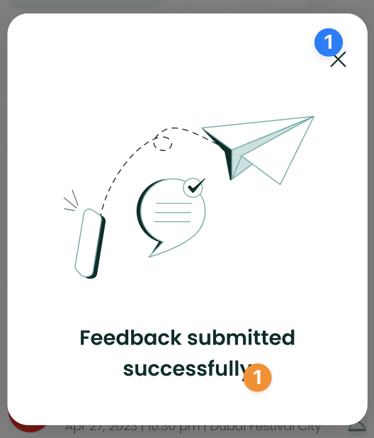

# TransactionDetailComponent



The `TransactionDetailComponent` shows users information about a
specific transaction and allows them to update its category or Brand, in
case they are inaccurate.

To use this view in a SwiftUI project, just call the
`TransactionDetailComponent` method of your `LuneSDKManager` instance as
shown in the example below. The method takes the `id` of the transaction
as an argument.

```swift
// DetailView.Swift

import SwiftUI
import LuneSDK

struct DetailView: View {
    // removed for simplicity...

    var body: some View {
        luneSDK.TransactionDetailComponent(
            id: "<transaction.id>"
        )
    }
}
```

To use this view in an Objective-C project, just call the
`TransactionDetailComponent` method of your `LuneSDKObjcManager`
instance as shown in the example below. The method takes the `id` of the
transaction as an argument, along with a `boolean` flag to enable notes.

```swift
// YourViewController.m

- (void)viewDidLoad {
    [super viewDidLoad];

    // transaction detail setup, after initilizing luneSDK

    UIViewController *hostingController = [self.luneSDK TransactionDetailComponentWithConfig:nil id:@"<transaction.id>" withNotes:true];

    [self addChildViewController:hostingController];
    [self.view addSubview:hostingController.view];

    // constraints setup removed for simplicity...
}
```

---

## Localization Keys and Analytics


Analytics Tags

1. `report_transaction_button`
2. `save_button`

Localization Keys

1. `lune_sdk_str_amount`
2. `lune_sdk_str_date`, `lune_sdk_str_date_time`
3. `lune_sdk_str_category`
4. `lune_sdk_str_suggested_category`
5. `lune_sdk_str_raw_transaction`
6. `lune_sdk_str_notes`
7. `lune_sdk_str_tap_to_add_notes`
8. `lune_sdk_str_tags`
9. `lune_sdk_str_tap_to_add_tags`
10. `lune_sdk_str_report_transaction`, `lune_sdk_str_cancel_report`
11. `lune_sdk_str_save`

---



Analytics Tags

1. `close_button`
2. `incorrect_brand_tile`
3. `incorrect_logo_tile`
4. `incorrect_category_tile`
5. `report_button`

Localization Keys

1. `lune_sdk_str_report_transaction__title`
2. `lune_sdk_str_incorrect_brand_name`
3. `lune_sdk_str_suggested_brand`
4. `lune_sdk_str_incorrect_logo`
5. `lune_sdk_str_incorrect_category`
6. `lune_sdk_str_report`
7. `lune_sdk_str_brand_name`

---



Analytics Tags

1. `close_button`
2. `category_filter_option`
3. `custom_category_button`
4. `submit_button`

Localization Keys

1. `lune_sdk_str_report_category`
2. `lune_sdk_str_please_select_your_recommended_category`
3. `lune_sdk_str_search`
4. `lune_sdk_str_add_a_custom_category`
5. `lune_sdk_str_submit`

---



Analytics Tags

1. `close_button`
2. `submit_button`

Localization Keys

1. `lune_sdk_str_add_a_custom_category`
2. `lune_sdk_str_category_field_label`
3. `lune_sdk_str_category_name`
4. `lune_sdk_str_submit`

---



Analytics Tags

1. `close_button`

Localization Keys

1. `lune_sdk_str_feedback_submitted_successfully`
