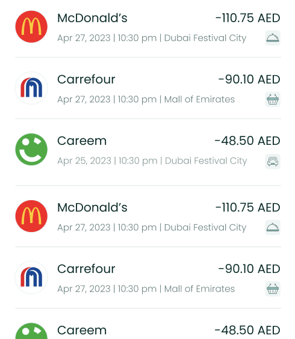
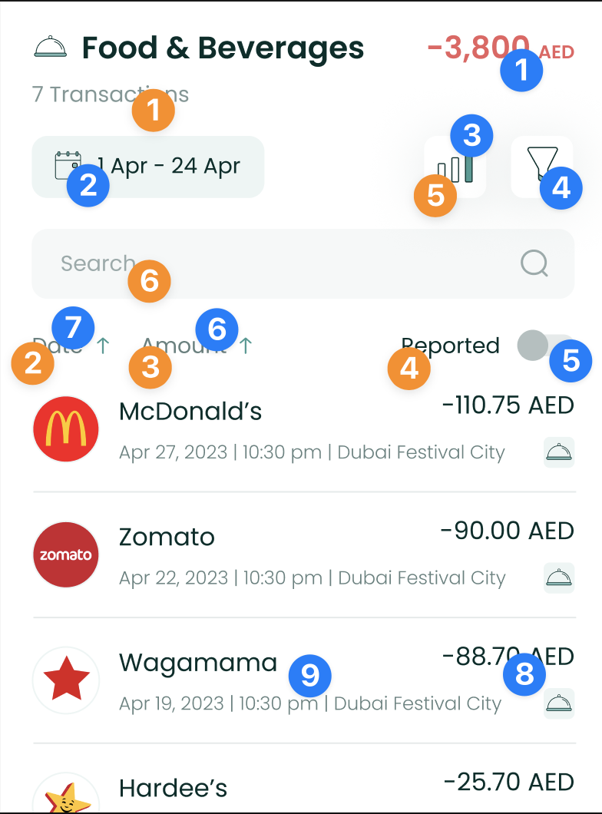
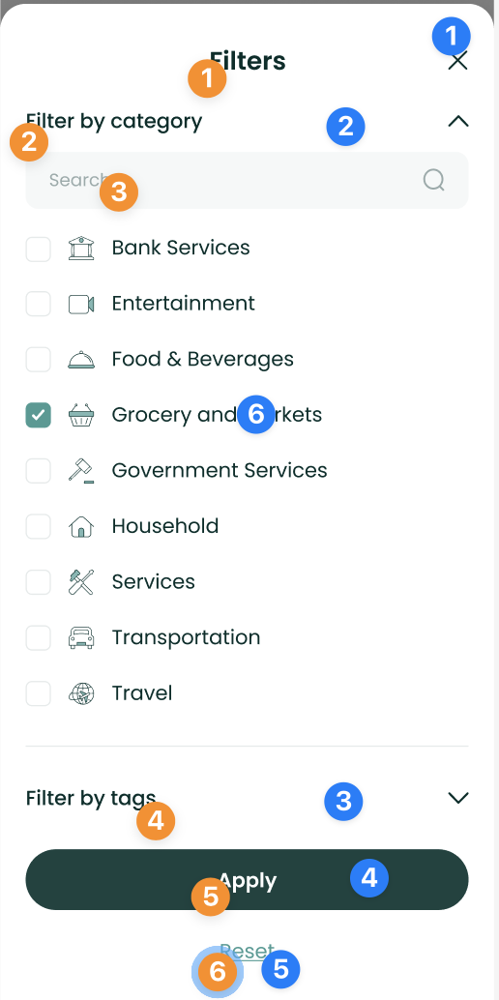
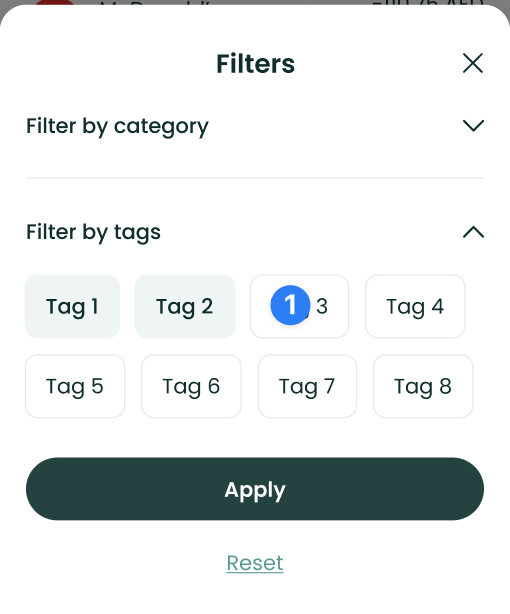

# TransactionListComponent



The `TransactionListComponent` shows a list of enriched transactions in
a user-friendly way, with each transaction having an associated brand.

To use this view in a SwiftUI project, just call the
`TransactionListComponent` method of your `LuneSDKManager` instance as
shown in the example below.

```swift
// HomeView.Swift

import SwiftUI
import LuneSDK

struct HomeView: View {
    // removed for simplicity...

    var body: some View {
        luneSDK.TransactionListComponent()
    }
}
```

To use this view in an Objective-C project, just call the
`TransactionListComponent` method of your `LuneSDKObjcManager` instance
as shown in the example below.

```swift
// YourViewController.m

- (void)viewDidLoad {
    [super viewDidLoad];
    
    // transaction list setup, after initilizing luneSDK

    UIViewController *hostingController = [self.luneSDK TransactionListComponentWithConfig:nil];

    [self addChildViewController:hostingController];
    [self.view addSubview:hostingController.view];
    
    // constraints setup removed for simplicity...
}
```

---

## Localization Keys and Analytics



Analytics Tags

1. `summary_amount`
2. `date_picker_button`
3. `trends_button`
4. `filter_button`
5. `reported_switch`
6. `amount_sort_button`
7. `date_sort_button`
8. `transaction_amount`
9. `transaction_tile`

Localization Keys

1. `lune_sdk_str_transaction_count`
2. `lune_sdk_str_date`
3. `lune_sdk_str_amount`
4. `lune_sdk_str_reported`
5. `lune_sdk_str_trends`
6. `lune_sdk_str_search`

---



Analytics Tags

1. `close_button`
2. `category_filter_pane`
3. `tag_filter_pane`
4. `apply_button`
5. `reset_button`

Localization Keys

1. `lune_sdk_str_filters`
2. `lune_sdk_str_filter_by_category`
3. `lune_sdk_str_search`
4. `lune_sdk_str_filter_by_tag`
5. `lune_sdk_str_apply`
6. `lune_sdk_str_reset`

---



Analytics Tags

1. `tag_filter_option`
