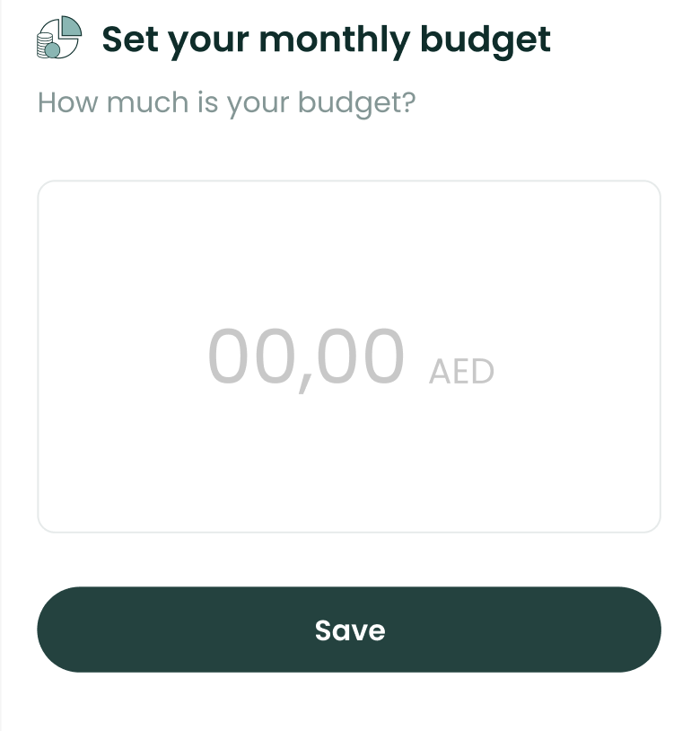

# BudgetFormComponent



The `BudgetFormComponent` allows the user to set up a new budget.

To use this view in a SwiftUI project, just call the
`BudgetFormComponent` method of your `LuneSDKManager` instance as shown
in the example below.

```swift
// SetBudgetView.Swift

import SwiftUI
import LuneSDK

struct SetBudgetView: View {
    // removed for simplicity...

    var body: some View {
        luneSDK.BudgetFormComponent()
    }
}
```

To use this view in an Objective-C project, just call the
`BudgetFormComponent` method of your `LuneSDKObjcManager` instance as
shown in the example below.

```swift
// YourViewController.m

- (void)viewDidLoad {
    [super viewDidLoad];

    // budget form setup, after initilizing luneSDK

    UIViewController *hostingController = [self.luneSDK BudgetFormComponentWithConfig:nil];

    [self addChildViewController:hostingController];
    [self.view addSubview:hostingController.view];

    // constraints setup removed for simplicity...
}
```
