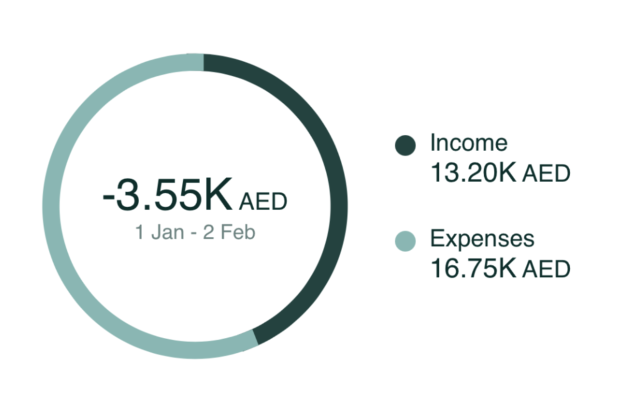

# CashflowChartComponent



The `CashflowChartComponent` shows the user's gross expense and income
over a period of time, along with the difference between them in a clean
customisable donut chart.

To use this view in a SwiftUI project, just call the
`CashflowChartComponent` method of your `LuneSDKManager` instance as
shown in the example below. You can pass in optional `startDate` and
`endDate` arguments to filter the data shown.

```swift
// HomeView.Swift

import SwiftUI
import LuneSDK

struct HomeView: View {
    // removed for simplicity...

    var body: some View {
        luneSDK.CashflowChartComponent()
    }
}
```

To use this view in an Objective-C project, just call the
`CashflowChartComponent` method of your `LuneSDKObjcManager` instance as
shown in the example below.

```swift
// YourViewController.m

- (void)viewDidLoad {
    [super viewDidLoad];
    
    // transaction list setup, after initilizing luneSDK

    UIViewController *hostingController = [self.luneSDK CashflowChartComponentWithStartDate:nil endDate:nil];

    [self addChildViewController:hostingController];
    [self.view addSubview:hostingController.view];
    
    // constraints setup removed for simplicity...
}
```
