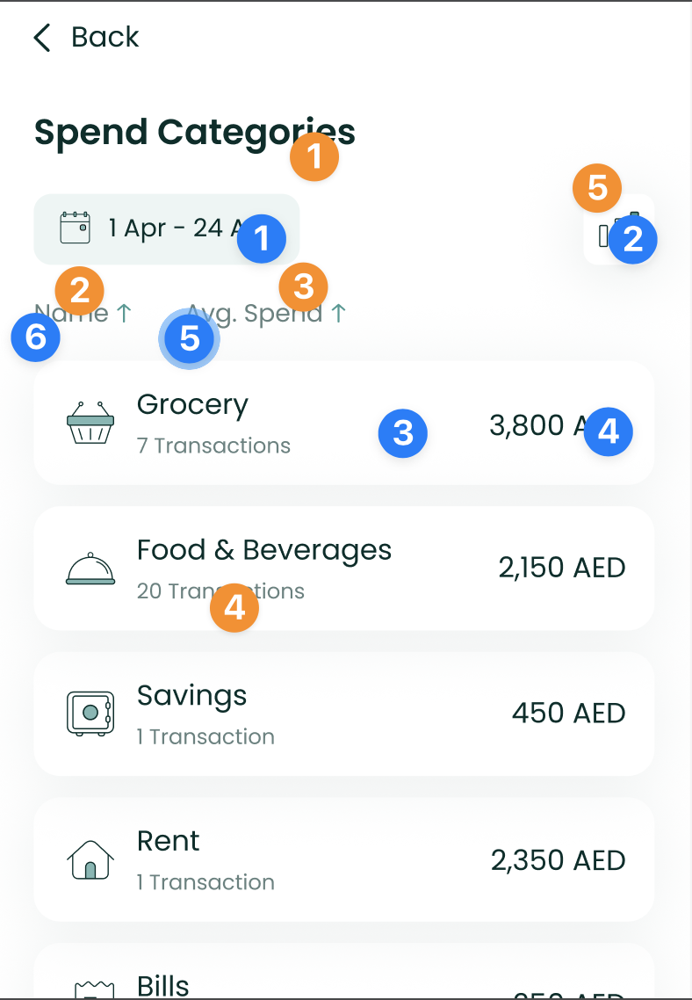
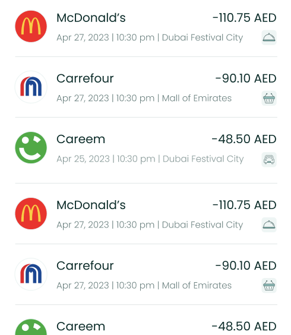
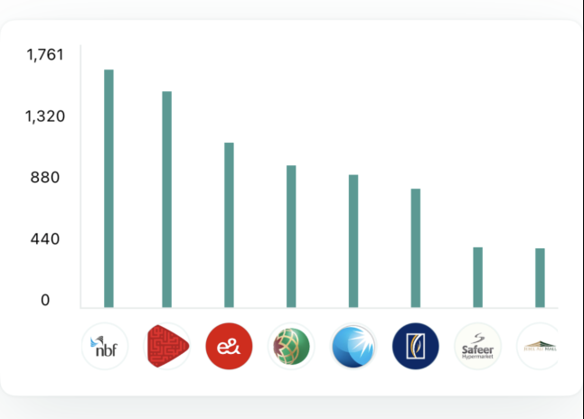

# Documentation for the Lune PFM iOS SDK

# Installation

There are a bunch of options to choose from when it comes to how to
install the `LuneSDK`.

Follow the instructions below for any of the options you prefer:

1.  Swift Package Manager (SPM)
    (<https://doc.clickup.com/d/h/4d6uf-18484/713a50aa0d61590/4d6uf-11318>)
2.  CocoaPods
    (<https://doc.clickup.com/d/h/4d6uf-18484/713a50aa0d61590/4d6uf-11338>)
3.  Manually - using raw XCFramework
    (<https://doc.clickup.com/d/h/4d6uf-18484/713a50aa0d61590/4d6uf-11358>)

---

With that done, you should be able to import the SDK into any of your
Swift files as shown below.

```swift
import LuneSDK
```

# Swift Package Manager (SPM)

You can add the `LuneSDK` to your project directly within xcode using
Swift Package Manager.

To do so:

1.  Open up your project in xcode, and in the menu bar, click on to
    `File` \> `Add Package Dependencies...`
2.  Paste `https://github.com/Lune-Technologies/lune-pfm-sdk-ios.git`
    into the **Search Bar** at the top-right of the page.
3.  Click on **Add Package**
4.  Select the target you want to add the SDK to, if necessary.
5.  Let Xcode download the package and set everything up.

# CocoaPods

To install the `LuneSDK` into your project using CocoaPods, add the
following to your `Podfile` file:

```elixir
use_frameworks!


target 'MyApp' do

# Add the LuneSDK pod 👇🏽
pod 'LuneSDK'

# ...

end
```

Then run `pod install` to install `LuneSDK` in your workspace.

Should you encounter an error about the bundle needing signing on Xcode
14, add the following post-install script in your podfile.

```ruby
post_install do |installer|

    installer.pods_project.targets.each do |target|

      if target.respond_to?(:product_type) and target.product_type == "com.apple.product-type.bundle"
        target.build_configurations.each do |config|
            config.build_settings['CODE_SIGNING_ALLOWED'] = 'NO'
      end

    end

end

```

# Manually - using raw XCFramework

You can also add the `LuneSDK` to your project manually, using the raw
`xcframework`.

To do so:

1.  Add the `.xcframework` provided to you into your Xcode project by
    simply dragging it into the Project navigator.
2.  In the resulting pop-up, ensure that the "Copy items if needed"
    option is checked and click "Finish"
3.  Select your project in the Project Navigator, and allow the Targets
    settings to load.
4.  Under the General tab, scroll to reveal the Frameworks, Libraries
    and Embedded Content section.
5.  In that section, click the dropdown button next to
    `LuneSDK.xcframework` and select "Embed and Sign"

# Initialization

To initialize the SDK, you simply have to create an instance of
`LuneSDKManager` (or `LuneSDKObjcManager` for Objective-C)  that would
be used across your app.

Provided that you will need to initialize LuneSDK with credentials, you
may want to do all the prep work within a view-model. That includes
things like:

- getting the credentials
- setting up a refresh callback (optional, based on the TTL of your
  credentials)
- setting up logging (also optional)

You can find specific implementation details for your project setup
below:

1.  SwiftUI
    (<https://doc.clickup.com/d/h/4d6uf-18484/713a50aa0d61590/4d6uf-11278>)
2.  Objective C
    (<https://doc.clickup.com/d/h/4d6uf-18484/713a50aa0d61590/4d6uf-11298>)

# SwiftUI

Follow the steps below to initialize LuneSDK in your `SwiftUI` Project.

```swift
// MyViewModel.Swift

import Foundation
import LuneSDK // 1. Import LuneSDK

class MyViewModel: ObservableObject {

  // 2. Add a property to hold the LuneSDKManager instance
  @Published var luneSDKManager: LuneSDKManager? = nil

    init() {

        Task {
           // 3. do everything you need to do to get your credentials
           await getCredentials()

           // 4. initialize the SDK with your credentials
           let sdk = LuneSDKManager(
                baseUrl: "<your.base.url>"
                token: "<your.token>",
                customerId: "<user.customer.id>"
            )

           // 5. optional: set up a refresh callback to handle token refresh
            sdk.setupRefreshCallback(getRefreshToken)


           // 6. optional: set up an event logger if you need to be informed about user actions in the SDK (for analytics)
            sdk.initializeLogger { eventMap in
                print("Logging event: \(eventMap)");
            }


           // 7. assign the SDK to the published property
            DispatchQueue.main.async { [self] in
                self.luneSDKManager = sdk
            }
        }
    }

    private func getCredentials() async {
        // do everything you need to do to get your credentials (from server, or env, etc)
    }

    func getRefreshToken() async -> String? {
        // do everything you need to do to get a refresh token
        return "<refresh_token>"
    }
}
```

Here's a breakdown of the steps within your view-model:

1.  Import `LuneSDK`
2.  Instantiate a published property to hold the SDK instance. This
    would be referenced from your view. You can call it anything - in
    this case, we'd go with `luneSDKManager`
3.  Get LuneSDK credentials (`baseUrl` and `token`) ready. This could be
    by making requests to a server if your credentials are stored on
    your backend, or even jut reading them from some environment
    variables if that's what you use.
4.  Initialize the SDK with the credentials and `customerId`.
5.  Optional: Set up a refresh callback function. It should be an
    `async` function with return type `String?`. This function would be
    called whenever your token expires.
6.  Optional: Set up a logging function for analytics events. This
    function should take in a map of `String` to `Any`, and it will be
    used to report user actions to you.
7.  Assign the initialized SDK to the published property,
    `luneSDKManager`.

**SwiftUI Tip:**

While you could create multiple instances of `LuneSDKManager`, we
recommend that you create just one instance per app.

You could share that single instance with other views using [Environment
Objects](https://developer.apple.com/documentation/swiftui/managing-model-data-in-your-app#:~:text=Share%20an%20object%20throughout%20your%20app).

```swift
// MyApp.Swift

import SwiftUI
import LuneSDK // 1. Import LuneSDK

@main
struct MyApp: App {

    @ObservedObject private var viewModel = MyViewModel()

    // 2. create getter
    var luneSDKManager: LuneSDKManager? {
        viewModel.luneSDKManager
    }

    var body: some Scene {
        WindowGroup {

            if(luneSDKManager != nil) {
                ContentView()
                  .environmentObject(luneSDKManager!) // 3. optional: share instance with other views in the app's hierarchy
            }

        }
    }
}
```

Here's a breakdown of the steps within your view:

1.  Import `LuneSDK`
2.  Create a getter for the published property in your view-model,
    `luneSDKManager`
3.  You can use `luneSDKManager` directly at this point, but you may
    want to pass it down your view hierarchy, so as to share the
    instance and not have to do the set up everywhere else.

You can then use the `LuneSDKManager` instance in any view of your app
as shown below.

```swift
// HomeView.Swift

import SwiftUI
import LuneSDK // 1.

struct HomeView: View {

    // 2. Get instance with @EnvironmentObject
    @EnvironmentObject var luneSDK: LuneSDKManager

    var body: some View {
        ScrollView{
            // 3. Use instance to inject any view of your choice
            luneSDK.TransactionListComponent()
        }
    }
}
```

# Objective C

**Update Needed:**

The Objective-C implementation needs to be updated in light of recent
breaking changes.

This documentation will be updated right after updates have been tested
and pushed.

Follow the steps below to initialize LuneSDK in your `Obj-C` Project.

```swift
// YourViewController.m

@import LuneSDK;
@interface YourViewController ()


// Declare luneSDK as a property of the class
@property (nonatomic, strong) LuneSDKObjcManager *luneSDK;

@end

@implementation YourViewController

- (void)viewDidLoad {
    [super viewDidLoad];

    // Initialize the SDK with your credentials.

    _luneSDK = [
        [LuneSDKObjcManager alloc]
        initWithBaseUrl:@"<your.base.url>"
        token:@"<your.token>",
        customerId:@"<user.customer.id>"
    ];
}
```

You can then use the `LuneSDKObjcManager` instance in any view of your
app as shown below.

```swift
// YourViewController.m

// budget summary setup, after the above setup is complete

// Create a new view controller instance using the BudgetSummaryComponentWithConfig method of the LuneSDK.
UIViewController *hostingController = [self.luneSDK BudgetSummaryComponent];

// Add the new view controller as a child view controller of the current view controller.
[self addChildViewController:hostingController];

// Add the new view controller's view as a subview of the current view controller's view.
[self.view addSubview:hostingController.view];

// Disable the autoresizing mask translation for the new view controller's view to enable the use of Auto Layout constraints.
hostingController.view.translatesAutoresizingMaskIntoConstraints = NO;

// Activate Auto Layout constraints to pin the new view controller's view to the edges of the current view controller's view.
[NSLayoutConstraint activateConstraints:@[
    [hostingController.view.topAnchor constraintEqualToAnchor:self.view.topAnchor],
    [hostingController.view.leadingAnchor constraintEqualToAnchor:self.view.leadingAnchor],
    [hostingController.view.trailingAnchor constraintEqualToAnchor:self.view.trailingAnchor],
    [hostingController.view.bottomAnchor constraintEqualToAnchor:self.view.bottomAnchor],
]];
```

# Customization

The SDK has lots of configurable parameters which can be overridden by
setting up a `JSON` file with a schema similar to the one attached
below. You could just download the file and modify the values you wish
to change.

[lune-config.json](https://t4627279.p.clickup-attachments.com/t4627279/5c2ae4d5-a96d-46ce-b5ac-1b38de4636c0/lune-config.json)

The `JSON` file should be saved as `lune-config.json` and added to as a
`Data Set`, with the name `LuneConfig` in your XCode project.

The assets specified in the config file should be present within your
`XCAssets` file with the same name used in the config file.

**Note:**

Necessary variants of the fonts mentioned in the config file should be
added to the project as well, within the `<project-name>` directory.

e.g

`|- LuneBank`

`|- - Info.plist`

`|- - Poppins_regular.ttf` 👈🏽

`|- - Poppins_semibold.ttf` 👈🏽

`|- - Poppins_bold.ttf` 👈🏽

Also, don't forget to set up the fonts in `Info.plist` e.g

```xml
<?xml version="1.0" encoding="UTF-8"?>
<!DOCTYPE plist PUBLIC "-//Apple//DTD PLIST 1.0//EN" "http://www.apple.com/DTDs/PropertyList-1.0.dtd">
<plist version="1.0">
<dict>

    <!-- everything else -->

    <key>UIAppFonts</key>
    <array>
        <string>Poppins_regular.ttf</string>
        <string>Poppins_bold.ttf</string>
        <string>Poppins_semibold.ttf</string>
    </array>
</dict>
</plist>
```

# Localization and Strings

If your app is already localized, the SDK would be localized as well -
no configurations needed. If your app is not localized, however, the SDK
respects that and stays in English to preserve consistency and
uniformity across your app.

## String Overrides

You can override specific strings by assigning a different value to the
same string keys used by the SDK.

The Strings used in the SDK can be found in the localization file
attached below.

[lunesdk-localizations.zip](https://t4627279.p.clickup-attachments.com/t4627279/5fa90c91-935c-4c2d-ad2f-4e8ed9c06be9/lunesdk-localizations.zip)

As you may have noticed, the keys are unique and should not conflict
with any other strings in your project.

If your app has multiple string files, you might want to point the SDK
to the specific file you want it to read overrides from.

You can do that by providing the file name as a value for the optional
`localizationTableName` parameter in the SDK initializer.

```less
LuneSDKManager(
    baseUrl: "<your.base.url>"
    token: "<your.token>",
    customerId: "<user.customer.id>",
    localizationTableName: "<strings file name>"
)
```

`tableName`

The name of the table containing the key-value pairs. Also, the suffix
for the strings file (a file with the `.strings` extension) to store the
localized string. This defaults to the table
in `Localizable.strings` when `tableName` is `nil` or an empty string.

# Images

You can override any of the images in `LuneSDK` by simply giving any
other images in your project the exact same name.

Each image is named using the format:

```gherkin
lune_sdk_asset_<image_name>
```

You can find a list of the images you can override here:

[lune-sdk-asset-names.txt](https://t4627279.p.clickup-attachments.com/t4627279/211cc3ee-0094-45c4-94aa-305d8c2b046e/lune-sdk-asset-names.txt)

# Components

The Lune SDK components are broadly divided into full-page views and
smaller (mix and match) components.

## Full page views

These components are typically large and were designed to be used as
stand-alone components on a page. While you could still choose to do so,
we strongly discourage adding other widgets as siblings to full page
views.

#### Examples are:

1.  CashflowComponent
    (<https://doc.clickup.com/d/h/4d6uf-18484/713a50aa0d61590/4d6uf-6184>)
2.  Expense Component
    (<https://doc.clickup.com/d/h/4d6uf-18484/713a50aa0d61590/4d6uf-11458>)
3.  TransactionListComponent
    (<https://doc.clickup.com/d/h/4d6uf-18484/713a50aa0d61590/4d6uf-6044>)
4.  TransactionDetailComponent
    (<https://doc.clickup.com/d/h/4d6uf-18484/713a50aa0d61590/4d6uf-6064>)
5.  BrandTrendsComponent
    (<https://doc.clickup.com/d/h/4d6uf-18484/713a50aa0d61590/4d6uf-6204>)
6.  CategoryTrendsComponent
    (<https://doc.clickup.com/d/h/4d6uf-18484/713a50aa0d61590/4d6uf-6224>)
7.  CategorySpendListComponent
    (<https://doc.clickup.com/d/h/4d6uf-18484/713a50aa0d61590/4d6uf-6164>)
8.  BrandListComponent
    (<https://doc.clickup.com/d/h/4d6uf-18484/713a50aa0d61590/4d6uf-6084>)
9.  BudgetComponent
    (<https://doc.clickup.com/d/h/4d6uf-18484/713a50aa0d61590/4d6uf-6264>)

## Smaller (mix and match) Components

These components are usually small enough and could easily be arranged
as siblings of other widgets on a page.

Examples are:

1.  CashflowChartComponent
    (<https://doc.clickup.com/d/h/4d6uf-18484/713a50aa0d61590/4d6uf-9098>)
2.  CategorySpendChartComponent
    (<https://doc.clickup.com/d/h/4d6uf-18484/713a50aa0d61590/4d6uf-6144>)
3.  CategoryTrendChartComponent
    (<https://doc.clickup.com/d/h/4d6uf-18484/713a50aa0d61590/4d6uf-9118>)
4.  BrandTrendChartComponent
    (<https://doc.clickup.com/d/h/4d6uf-18484/713a50aa0d61590/4d6uf-9138>)
5.  BudgetFormComponent
    (<https://doc.clickup.com/d/h/4d6uf-18484/713a50aa0d61590/4d6uf-6104>)
6.  BudgetSummaryComponent
    (<https://doc.clickup.com/d/h/4d6uf-18484/713a50aa0d61590/4d6uf-6124>)

# CashflowComponent


The `CashflowComponent` shows the user's gross expense and income over a
period of time, along with the difference between them.

To use this view in a SwiftUI project, just call the `CashflowComponent`
method of your `LuneSDKManager` instance as shown in the example below.

```swift
// HomeView.Swift

import SwiftUI
import LuneSDK

struct HomeView: View {
    // removed for simplicity...

    var body: some View {
        luneSDK.CashflowComponent()
    }
}
```

✨ You can now add an optional argument to the `slotContent` parameter
if you need to render a custom view below the page content.

Here is a simple example with a list of cards.

```swift
// HomeView.Swift

import SwiftUI
import LuneSDK

struct HomeView: View {
    // removed for simplicity...
    var body: some View {

        luneSDK.CashflowComponent(
            slotContent: {

                // add any custom view in here 👇🏽

                VStack(alignment: .leading) {
                    HStack {
                        Text("Title")
                        Spacer()
                        Text("Action")
                    }
                    ScrollView(.horizontal) {
                       HStack {
                            ForEach(0..<5, id: \.self) { _ in
                                Text("Hey yo!")
                                .padding()
                                .background(Color.random())
                            }
                        }
                    }
                }
                .padding()

            }
        )
    }
}
```

To use this view in an Objective-C project, just call the
`CashflowComponent` method of your `LuneSDKObjcManager` instance as
shown in the example below.

```swift
// YourViewController.m

- (void)viewDidLoad {
    [super viewDidLoad];

    // cashflow setup, after initilizing luneSDK

    UIViewController *hostingController = [self.luneSDK CashflowComponentWithConfig:nil];

    [self addChildViewController:hostingController];
    [self.view addSubview:hostingController.view];

    // constraints setup removed for simplicity...
}
```

---

## Localization Keys and Analytics


Analytics Tags

1.  `cashflow_amount`
2.  `outflow_amount`
3.  `outflow_tile`
4.  `inflow_tile`

Localization Keys

1.  `lune_sdk_str_outflow`
2.  `lune_sdk_str_inflow`
3.  `lune_sdk_str_you've_spent_`,
    `lune_sdk_str__more_than_you_have_earned`,
    `lune_sdk_str_you've_earned_`,
    `lune_sdk_str__more_than_you_have_spent`

# Expense Component


The `ExpenseComponent` shows the user's spend across categories in a
neat donut chart, along with a list of recent transactions. Users are
able to view data for previous months easily too.

To use this view in a SwiftUI project, just call the `ExpenseComponent`
method of your `LuneSDKManager` instance as shown in the example below.

```swift
// HomeView.Swift

import SwiftUI
import LuneSDK

struct HomeView: View {
    // removed for simplicity...

    var body: some View {
        luneSDK.ExpenseComponent()
    }
}
```

✨ You can now add an optional argument to the `slotContent` parameter
if you need to render a custom view between the chart and the
transaction list.

Here is a simple example with a list of cards.

```swift
// HomeView.Swift

import SwiftUI
import LuneSDK

struct HomeView: View {
    // removed for simplicity...
    var body: some View {

        luneSDK.ExpenseComponent(
            slotContent: {

                // add any custom view in here 👇🏽

                VStack(alignment: .leading) {
                    HStack {
                        Text("Title")
                        Spacer()
                        Text("Action")
                    }
                    ScrollView(.horizontal) {
                       HStack {
                            ForEach(0..<5, id: \.self) { _ in
                                Text("Hey yo!")
                                .padding()
                                .background(Color.random())
                            }
                        }
                    }
                }
                .padding()

            }
        )
    }
}
```

To use this view in an Objective-C project, just call the
`ExpenseComponent` method of your `LuneSDKObjcManager` instance as shown
in the example below.

```swift
// YourViewController.m

- (void)viewDidLoad {
    [super viewDidLoad];

    // cashflow setup, after initilizing luneSDK

    UIViewController *hostingController = [self.luneSDK ExpenseComponentWithConfig:nil];

    [self addChildViewController:hostingController];
    [self.view addSubview:hostingController.view];

    // constraints setup removed for simplicity...
}
```

---

## Localization Keys and Analytics


Analytics Tags

1.  `date_picker_button`
2.  `chart_icon`
3.  `chart_view_all`
4.  `transaction_amount`
5.  `transaction_tile`
6.  `transactions_view_all`

Localization Keys

1.  `lune_sdk_str_view_all`
2.  `lune_sdk_str_view_all`
3.  `lune_sdk_str_transactions`

---



Analytics Tags

1.  `date_picker_button`
2.  `trends_button`
3.  `category_tile`
4.  `category_amount`
5.  `avg_spend_sort_button`
6.  `name_sort_button`

Localization Keys

1.  `lune_sdk_str_spend_categories`
2.  `lune_sdk_str_name`
3.  `lune_sdk_str_avg_spend`
4.  `lune_sdk_str_transaction_count`
5.  `lune_sdk_str_trends`

# TransactionListComponent



The `TransactionListComponent` shows a list of enriched transactions in
a user-friendly way, with each transaction having an associated brand.

To use this view in a SwiftUI project, just call the
`TransactionListComponent` method of your `LuneSDKManager` instance as
shown in the example below.

```swift
// HomeView.Swift

import SwiftUI
import LuneSDK

struct HomeView: View {
    // removed for simplicity...

    var body: some View {
        luneSDK.TransactionListComponent()
    }
}
```

To use this view in an Objective-C project, just call the
`TransactionListComponent` method of your `LuneSDKObjcManager` instance
as shown in the example below.

```swift
// YourViewController.m

- (void)viewDidLoad {
    [super viewDidLoad];
    
    // transaction list setup, after initilizing luneSDK

    UIViewController *hostingController = [self.luneSDK TransactionListComponentWithConfig:nil];

    [self addChildViewController:hostingController];
    [self.view addSubview:hostingController.view];
    
    // constraints setup removed for simplicity...
}
```

---

## Localization Keys and Analytics


Analytics Tags

1.  `summary_amount`
2.  `date_picker_button`
3.  `trends_button`
4.  `filter_button`
5.  `reported_switch`
6.  `amount_sort_button`
7.  `date_sort_button`
8.  `transaction_amount`
9.  `transaction_tile`

Localization Keys

1.  `lune_sdk_str_transaction_count`
2.  `lune_sdk_str_date`
3.  `lune_sdk_str_amount`
4.  `lune_sdk_str_reported`
5.  `lune_sdk_str_trends`
6.  `lune_sdk_str_search`

---


Analytics Tags

1.  `close_button`
2.  `category_filter_pane`
3.  `tag_filter_pane`
4.  `apply_button`
5.  `reset_button`

Localization Keys

1.  `lune_sdk_str_filters`
2.  `lune_sdk_str_filter_by_category`
3.  `lune_sdk_str_search`
4.  `lune_sdk_str_filter_by_tag`
5.  `lune_sdk_str_apply`
6.  `lune_sdk_str_reset`

---


Analytics Tags

1.  `tag_filter_option`

# TransactionDetailComponent


The `TransactionDetailComponent` shows users information about a
specific transaction and allows them to update its category or Brand, in
case they are inaccurate.

To use this view in a SwiftUI project, just call the
`TransactionDetailComponent` method of your `LuneSDKManager` instance as
shown in the example below. The method takes the `id` of the transaction
as an argument.

```swift
// DetailView.Swift

import SwiftUI
import LuneSDK

struct DetailView: View {
    // removed for simplicity...

    var body: some View {
        luneSDK.TransactionDetailComponent(
            id: "<transaction.id>"
        )
    }
}
```

To use this view in an Objective-C project, just call the
`TransactionDetailComponent` method of your `LuneSDKObjcManager`
instance as shown in the example below. The method takes the `id` of the
transaction as an argument, along with a `boolean` flag to enable notes.

```swift
// YourViewController.m

- (void)viewDidLoad {
    [super viewDidLoad];

    // transaction detail setup, after initilizing luneSDK

    UIViewController *hostingController = [self.luneSDK TransactionDetailComponentWithConfig:nil id:@"<transaction.id>" withNotes:true];

    [self addChildViewController:hostingController];
    [self.view addSubview:hostingController.view];

    // constraints setup removed for simplicity...
}
```

---

## Localization Keys and Analytics


Analytics Tags

1.  `report_transaction_button`
2.  `save_button`

Localization Keys

1.  `lune_sdk_str_amount`
2.  `lune_sdk_str_date`, `lune_sdk_str_date_time`
3.  `lune_sdk_str_category`
4.  `lune_sdk_str_suggested_category`
5.  `lune_sdk_str_raw_transaction`
6.  `lune_sdk_str_notes`
7.  `lune_sdk_str_tap_to_add_notes`
8.  `lune_sdk_str_tags`
9.  `lune_sdk_str_tap_to_add_tags`
10. `lune_sdk_str_report_transaction`, `lune_sdk_str_cancel_report`
11. `lune_sdk_str_save`

---


Analytics Tags

1.  `close_button`
2.  `incorrect_brand_tile`
3.  `incorrect_logo_tile`
4.  `incorrect_category_tile`
5.  `report_button`

Localization Keys

1.  `lune_sdk_str_report_transaction__title`
2.  `lune_sdk_str_incorrect_brand_name`
3.  `lune_sdk_str_suggested_brand`
4.  `lune_sdk_str_incorrect_logo`
5.  `lune_sdk_str_incorrect_category`
6.  `lune_sdk_str_report`
7.  `lune_sdk_str_brand_name`

---


Analytics Tags

1.  `close_button`
2.  `category_filter_option`
3.  `custom_category_button`
4.  `submit_button`

Localization Keys

1.  `lune_sdk_str_report_category`
2.  `lune_sdk_str_please_select_your_recommended_category`
3.  `lune_sdk_str_search`
4.  `lune_sdk_str_add_a_custom_category`
5.  `lune_sdk_str_submit`

---


Analytics Tags

1.  `close_button`
2.  `submit_button`

Localization Keys

1.  `lune_sdk_str_add_a_custom_category`
2.  `lune_sdk_str_category_field_label`
3.  `lune_sdk_str_category_name`
4.  `lune_sdk_str_submit`

---


Analytics Tags

1.  `close_button`

Localization Keys

1.  `lune_sdk_str_feedback_submitted_successfully`

# BrandTrendsComponent


Besides showing the user's spend on each Brand, the
`BrandTrendsComponent` uses a chart to show the user's spend per day. It
also allows users to filter data by category, tags and dates by default.

To use this view in a SwiftUI project, just call the
`BrandTrendsComponent` method of your `LuneSDKManager` instance as shown
in the example below.

```swift
// Trends.Swift

import SwiftUI
import LuneSDK

struct TrendView: View {
    // removed for simplicity...

    var body: some View {
        luneSDK.BrandTrendsComponent()
    }
}
```

To use this view in an Objective-C project, just call the
`BrandTrendsComponent` method of your `LuneSDKObjcManager` instance as
shown in the example below.

```swift
// YourViewController.m

- (void)viewDidLoad {
    [super viewDidLoad];

    // brand trends setup, after initilizing luneSDK

    UIViewController *hostingController = [self.luneSDK BrandTrendsComponentWithConfig:nil];

    [self addChildViewController:hostingController];
    [self.view addSubview:hostingController.view];

    // constraints setup removed for simplicity...
}
```

---

## Localization Keys and Analytics


Analytics Tags

1.  `date_picker_button`
2.  `filter_button`
3.  `spending_amount`
4.  `brand_amount`
5.  `brand_tile`

Localization Keys

1.  `lune_sdk_str_brand_trends`
2.  `lune_sdk_str_spending`
3.  `lune_sdk_str_top_brands`

---


Analytics Tags

1.  `close_button`
2.  `category_filter_option`
3.  `apply_button`
4.  `reset_button`

Localization Keys

1.  `lune_sdk_str_filter_by_category`
2.  `lune_sdk_str_search`
3.  `lune_sdk_str_apply`
4.  `lune_sdk_str_reset`

# CategoryTrendsComponent


The `CategoryTrendsComponent` shows the user's spend across different
categories both in a chart, and in a list of category tiles. It allows
users to filter data by dates too.

To use this view in a SwiftUI project, just call the
`CategoryTrendsComponent` method of your `LuneSDKManager` instance as
shown in the example below.

```swift
// Trends.Swift

import SwiftUI
import LuneSDK

struct TrendView: View {
    // removed for simplicity...

    var body: some View {
        luneSDK.CategoryTrendsComponent()
    }
}
```

To use this view in an Objective-C project, just call the
`CategoryTrendsComponent` method of your `LuneSDKObjcManager` instance
as shown in the example below.

```swift
// YourViewController.m

- (void)viewDidLoad {
    [super viewDidLoad];

    // category trends setup, after initilizing luneSDK

    UIViewController *hostingController = [self.luneSDK CategoryTrendsComponentWithConfig:nil];

    [self addChildViewController:hostingController];
    [self.view addSubview:hostingController.view];

    // constraints setup removed for simplicity...
}
```

---

## Localization Keys and Analytics


Analytics Tags

1.  `filter_button`
2.  `spending_amount`
3.  `date_picker_button`
4.  `category_amount`
5.  `category_tile`

Localization Keys

1.  `lune_sdk_str_categories_trends`
2.  `lune_sdk_str_spending`
3.  `lune_sdk_str_top_categories`

---


Analytics Tags

1.  `close_button`
2.  `category_filter_option`
3.  `apply_button`
4.  `reset_button`

Localization Keys

1.  `lune_sdk_str_filter_by_category`
2.  `lune_sdk_str_search`
3.  `lune_sdk_str_apply`
4.  `lune_sdk_str_reset`

# CategorySpendListComponent


The `CategorySpendListComponent` shows the user's overall spend in
contrast to his budget and his expected spend per time.

To use this view in a SwiftUI project, just call the
`CategorySpendListComponent` method of your `LuneSDKManager` instance as
shown in the example below.

```swift
// BudgetView.Swift

import SwiftUI
import LuneSDK

struct BudgetView: View {
    // removed for simplicity...

    var body: some View {
        luneSDK.CategorySpendListComponent()
    }
}
```

To use this view in an Objective-C project, just call the
`CategorySpendListComponent` method of your `LuneSDKObjcManager`
instance as shown in the example below.

```swift
// YourViewController.m

- (void)viewDidLoad {
    [super viewDidLoad];

    // category spend setup, after initilizing luneSDK

    UIViewController *hostingController = [self.luneSDK CategorySpendListComponentWithConfig:nil];

    [self addChildViewController:hostingController];
    [self.view addSubview:hostingController.view];

    // constraints setup removed for simplicity...
}
```

# BrandListComponent


The `BrandListComponent` shows a list of brands the user has patronized.

To use this view in a SwiftUI project, just call the
`BrandListComponent` method of your `LuneSDKManager` instance as shown
in the example below.

```swift
// TrendsView.Swift

import SwiftUI
import LuneSDK

struct TrendsView: View {
    // removed for simplicity...

    var body: some View {
        luneSDK.BrandListComponent()
    }
}
```

To use this view in an Objective-C project, just call the
`BrandListComponent` method of your `LuneSDKObjcManager` instance as
shown in the example below.

```swift
// YourViewController.m

- (void)viewDidLoad {
    [super viewDidLoad];

    // brand list setup, after initilizing luneSDK

    UIViewController *hostingController = [self.luneSDK BrandListComponentWithConfig:nil];

    [self addChildViewController:hostingController];
    [self.view addSubview:hostingController.view];

    // constraints setup removed for simplicity...
}
```

# BudgetComponent


The `BudgetComponent` shows the user's spend against the budget he/she
had set previously. In the case that the user doesn't already have a
budget, it allows the user to set one easily.

To use this view in a SwiftUI project, just call the `BudgetComponent`
method of your `LuneSDKManager` instance as shown in the example below.

```swift
// BudgetComponent.Swift

import SwiftUI
import LuneSDK

struct BudgetComponent: View {
    // removed for simplicity...

    var body: some View {
        luneSDK.BudgetComponent()
    }
}
```

To use this view in an Objective-C project, just call the
`BudgetComponent` method of your `LuneSDKObjcManager` instance as shown
in the example below.

```swift
// YourViewController.m

- (void)viewDidLoad {
    [super viewDidLoad];

    // budget setup, after initilizing luneSDK

    UIViewController *hostingController = [self.luneSDK BudgetComponentWithConfig:nil];

    [self addChildViewController:hostingController];
    [self.view addSubview:hostingController.view];

    // constraints setup removed for simplicity...
}
```

# CashflowChartComponent


The `CashflowChartComponent` shows the user's gross expense and income
over a period of time, along with the difference between them in a clean
customisable donut chart.

To use this view in a SwiftUI project, just call the
`CashflowChartComponent` method of your `LuneSDKManager` instance as
shown in the example below. You can pass in optional `startDate` and
`endDate` arguments to filter the data shown.

```swift
// HomeView.Swift

import SwiftUI
import LuneSDK

struct HomeView: View {
    // removed for simplicity...

    var body: some View {
        luneSDK.CashflowChartComponent()
    }
}
```

To use this view in an Objective-C project, just call the
`CashflowChartComponent` method of your `LuneSDKObjcManager` instance as
shown in the example below.

```swift
// YourViewController.m

- (void)viewDidLoad {
    [super viewDidLoad];
    
    // transaction list setup, after initilizing luneSDK

    UIViewController *hostingController = [self.luneSDK CashflowChartComponentWithStartDate:nil endDate:nil];

    [self addChildViewController:hostingController];
    [self.view addSubview:hostingController.view];
    
    // constraints setup removed for simplicity...
}
```

# CategorySpendChartComponent


The `CategorySpendChartComponent` shows the user's most significant
spend across various expense categories.

To use this view in a SwiftUI project, just call the
`CategorySpendChartComponent` method of your `LuneSDKManager` instance
as shown in the example below.

```swift
// BudgetView.Swift

import SwiftUI
import LuneSDK

struct BudgetView: View {
    // removed for simplicity...

    var body: some View {
        luneSDK.CategorySpendChartComponent()
    }
}
```

To use this view in an Objective-C project, just call the
`CategorySpendChartComponent` method of your `LuneSDKObjcManager`
instance as shown in the example below.

```swift
// YourViewController.m

- (void)viewDidLoad {
    [super viewDidLoad];

    // category spend chart setup, after initilizing luneSDK

    UIViewController *hostingController = [self.luneSDK CategorySpendChartComponentWithConfig:nil];

    [self addChildViewController:hostingController];
    [self.view addSubview:hostingController.view];

    // constraints setup removed for simplicity...
}
```

# CategoryTrendChartComponent


The `CategoryTrendChartComponent` shows the user's spend across
different categories in a bar chart.

To use this view in a SwiftUI project, just call the
`CategoryTrendChartComponent` method of your `LuneSDKManager` instance
as shown in the example below. You can pass in optional `startDate` and
`endDate` arguments to filter the data shown.

```swift
// HomeView.Swift

import SwiftUI
import LuneSDK

struct HomeView: View {
    // removed for simplicity...

    var body: some View {
        luneSDK.CategoryTrendChartComponent()
    }
}
```

To use this view in an Objective-C project, just call the
`CategoryTrendChartComponent` method of your `LuneSDKObjcManager`
instance as shown in the example below.

```swift
// YourViewController.m

- (void)viewDidLoad {
    [super viewDidLoad];
    
    // transaction list setup, after initilizing luneSDK

    UIViewController *hostingController = [self.luneSDK CategoryTrendChartComponentWithStartDate:nil endDate:nil];

    [self addChildViewController:hostingController];
    [self.view addSubview:hostingController.view];
    
    // constraints setup removed for simplicity...
}
```

# BrandTrendChartComponent



The `BrandTrendChartComponent` shows the user's spend across different
brands in a bar chart.

To use this view in a SwiftUI project, just call the
`BrandTrendChartComponent` method of your `LuneSDKManager` instance as
shown in the example below. You can pass in optional `startDate` and
`endDate` arguments to filter the data shown.

```swift
// HomeView.Swift

import SwiftUI
import LuneSDK

struct HomeView: View {
    // removed for simplicity...

    var body: some View {
        luneSDK.BrandTrendChartComponent()
    }
}
```

To use this view in an Objective-C project, just call the
`BrandTrendChartComponent` method of your `LuneSDKObjcManager` instance
as shown in the example below.

```swift
// YourViewController.m

- (void)viewDidLoad {
    [super viewDidLoad];
    
    // transaction list setup, after initilizing luneSDK

    UIViewController *hostingController = [self.luneSDK BrandTrendChartComponentWithStartDate:nil endDate:nil];

    [self addChildViewController:hostingController];
    [self.view addSubview:hostingController.view];
    
    // constraints setup removed for simplicity...
}
```

# BudgetFormComponent


The `BudgetFormComponent` allows the user to set up a new budget.

To use this view in a SwiftUI project, just call the
`BudgetFormComponent` method of your `LuneSDKManager` instance as shown
in the example below.

```swift
// SetBudgetView.Swift

import SwiftUI
import LuneSDK

struct SetBudgetView: View {
    // removed for simplicity...

    var body: some View {
        luneSDK.BudgetFormComponent()
    }
}
```

To use this view in an Objective-C project, just call the
`BudgetFormComponent` method of your `LuneSDKObjcManager` instance as
shown in the example below.

```swift
// YourViewController.m

- (void)viewDidLoad {
    [super viewDidLoad];

    // budget form setup, after initilizing luneSDK

    UIViewController *hostingController = [self.luneSDK BudgetFormComponentWithConfig:nil];

    [self addChildViewController:hostingController];
    [self.view addSubview:hostingController.view];

    // constraints setup removed for simplicity...
}
```

# BudgetSummaryComponent


The `BudgetSummaryComponent` shows the user's overall spend in contrast
to his budget and his expected spend per time.

To use this view in a SwiftUI project, just call the
`BudgetSummaryComponent` method of your `LuneSDKManager` instance as
shown in the example below.

```swift
// BudgetView.Swift

import SwiftUI
import LuneSDK

struct BudgetView: View {
    // removed for simplicity...

    var body: some View {
        luneSDK.BudgetSummaryComponent()
    }
}
```

To use this view in an Objective-C project, just call the
`BudgetSummaryComponent` method of your `LuneSDKObjcManager` instance as
shown in the example below.

```swift
// YourViewController.m

- (void)viewDidLoad {
    [super viewDidLoad];

    // budget summary setup, after initilizing luneSDK

    UIViewController *hostingController = [self.luneSDK BudgetSummaryComponentWithConfig:nil];

    [self addChildViewController:hostingController];
    [self.view addSubview:hostingController.view];

    // constraints setup removed for simplicity...
}
```
